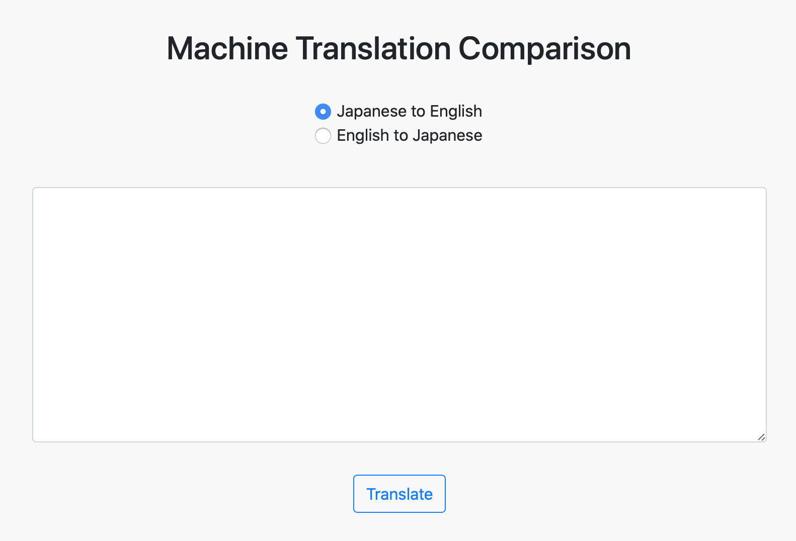
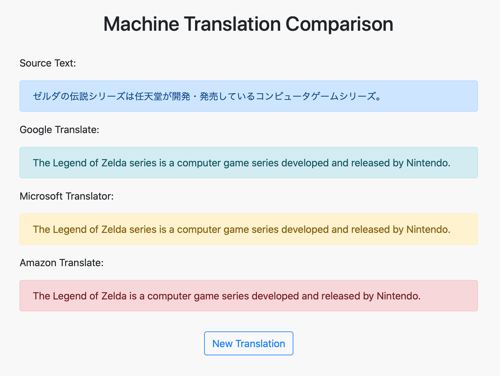

# Newspaper Project

### Overview

A basic newspaper application that displays news articles.

Built following chapters 8-15 of [Django for Beginners](https://djangoforbeginners.com). 

[Live demo](https://jjl-newspaper.herokuapp.com) (deployed on Heroku).

### Features

Uses a custom user model that inherits from AbstractUser. 

Includes user authentication with signup, login, and logout functionality. 

Includes password change and password reset functionality via email using SendGrid. 

Uses an Article model for newspaper articles, including an author field that is linked to the custom user model via a foreign key. 

Uses ListView, DetailView, CreateView, UpdateView, and DeleteView from Django's generic class-based views to provide CRUD functionality for handling articles. 

Includes user authorization through the use of mixins, specifically the LoginRequiredMixin to restrict access to logged-in users when viewing, creating, updating, or deleting an article, and the UserPassesTestMixin to further restrict access to article authors when updating or deleting an article. 

Extended beyond the textbook by: 
* separating sensitive information from the codebase using python-decouple,
* serving static and media files from an AWS S3 bucket,
* adding functionality for uploading images from the front end,
* adding functionality for adding comments to articles from the front end rather than only via the back-end admin app as in the original tutorial, and
* improving the overall front-end styling. 

### Built using:

* Python 3.7.6
* Django 3.0.8
* Gunicorn 20.0.4
* environs 8.0.0
* Bootstrap 4
* Pipenv 2018.11.26
* Black 20.8b1 (code formatting)
* Heroku
* Visual Studio Code 1.49.1
* macOS 10.15.6

### Screenshots:

List view:
 

Detail view:

